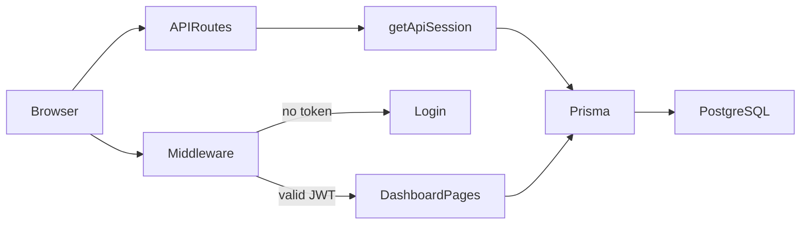

# Architecture overview

Campus Student Website (CSW) is a single Next.js application at the repository root.

## Stack

| Layer | Technology |
|-------|------------|
| Framework | Next.js 16 (App Router) |
| UI | React 19, Tailwind CSS 4 |
| Language | TypeScript |
| Database | PostgreSQL 14+ |
| ORM | Prisma 7 |
| Auth | JWT in httpOnly cookie (`jose`) |
| Validation | Zod |

## Repository layout

```
campus-student-website/
├── src/                      # App Router pages, API, components
│   ├── app/
│   ├── components/
│   ├── lib/
│   └── server/
├── prisma/                   # Schema, migrations, seed
├── tools/                    # One-off maintenance scripts (dev only)
├── storage/                  # Local file storage (gitignored contents)
├── docs/                     # Documentation
├── .github/workflows/        # CI
└── package.json
```

## Application structure (`src/`)

```
src/
├── app/
│   ├── api/                  # REST-style route handlers
│   ├── auth/                 # Login pages
│   ├── dashboard/            # Role-based dashboards
│   │   ├── admin/
│   │   ├── teacher/
│   │   ├── student/
│   │   └── canteen/
│   ├── layout.tsx
│   ├── middleware.ts         # Protects /dashboard/*
│   └── page.tsx              # Landing
├── components/
│   ├── auth/
│   ├── common/
│   ├── dashboard/
│   ├── documents/
│   ├── events/
│   ├── layout/
│   └── ui/
├── lib/
│   ├── auth.ts               # JWT sign/verify, cookie name
│   ├── session.ts            # Server session helpers
│   ├── api-auth.ts           # getApiSession for API routes
│   ├── prisma.ts             # Prisma singleton
│   └── …                     # Domain utilities
└── server/                   # Shared server modules (e.g. attendance)
```

## Request flow



1. **Pages under `/dashboard`** — `middleware.ts` reads the session cookie, verifies the JWT, enforces role-based path access, and redirects unauthenticated users to `/auth/login`.
2. **API routes under `/api`** — each handler calls `getApiSession()` (from `lib/api-auth.ts`), which also checks user block status and system lock. Unauthorized requests return `{ "error": "..." }`.
3. **Data** — Prisma client (`lib/prisma.ts`) talks to PostgreSQL. Migrations live in `prisma/migrations/`.

## Roles

| Role | Dashboard prefix | Purpose |
|------|------------------|---------|
| `STUDENT` | `/dashboard/student` | Schedule, grades, campus services |
| `TEACHER` | `/dashboard/teacher` | Classes, attendance, grading |
| `ADMIN` | `/dashboard/admin` | Users, classes, schedule, content |
| `CANTEEN_STAFF` | `/dashboard/canteen` | Menu management |

## API conventions

- Success: `{ "data": … }`
- Error: `{ "error": "message" }`
- Helpers: `lib/api-response.ts`

See [FEATURES.md](../FEATURES.md) for the full feature and API map.

## Local file storage

Document request attachments are stored on disk under `storage/`. This directory is not committed (only `.gitkeep` is tracked). In production, consider object storage (S3, etc.) if you deploy to multiple instances.
